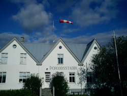

# Hvernig nýtast vindpokar?

## Birta Líf Kristinsdóttir 17.9.2012

Vindpokar eða vindsokkar eru notaðir á flugvöllum til að gefa flugmönnum sjónræna vísbendingu um stefnu og styrk vinds í flugtaki og lendingu.

Þessir pokar geta þó gagnast öðrum en flugmönnum en ökumenn við þjóðveg 1 geta t.d. nýtt sér einn slíkan poka við suðaustanvert Ingólfsfjall.

Allir pokar á Íslandi eru af þeirri gerð að fullstrekktir tákna þeir 15 hnúta vindstyrk (~7,5 m/s) eða meira.

Vindpokar geta verið í mörgum litum en hér á landi er heillitaður appelsínugulur poki í notkun eða röndóttur, hvítur og appelsínugulur.

Í reglum Aþjóðaflugmálastofnunarinnar (ICAO - Annex 14, 5.1.1.3) er mælst til að hafa fimm rendur þegar poki er röndóttur þar sem fyrsta og síðasta rönd skulu vera í dekkri litnum. Á slíkum pokum er auðvelt að meta vindstyrkinn en strekktur poki við fyrstu rönd sýnir 5 hnúta (u.þ.b. 2,5 m/s) og við aðra rönd eru það 10 hnútar (u.þ.b. 5 m/s). Hér á landi eru hins vegar notaðir pokar með eina hvíta rönd og táknar poki strekktur í hana þá 7 til 8 hnúta vind (3,5 - 4,0 m/s).

Samkvæmt reglum Alþjóðaflugmálastofnunarinnar eiga pokarnir að vera 3,6 m á lengd og 0,9 m í þvermál við breiðari endann. Pokarnir skulu hanga í 6 m hæð.

 eða meiri. Samkvæmt upplýsingum frá flugturni var vindurinn norðvest- lægur og 20 hnútar (10 m/s) þegar myndin var tekin 11.09.2012. Ljósmynd: Birta Líf Kristinsdóttir.")

Ítarlega er fjallað um [nöfn vindstiga og greiningu veðurhæðar](https://www.vedur.is/vedur/frodleikur/greinar/nr/1098) í fróðleiksgrein Trausta Jónssonar.